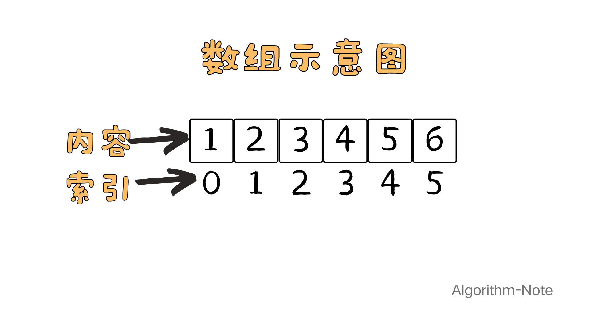
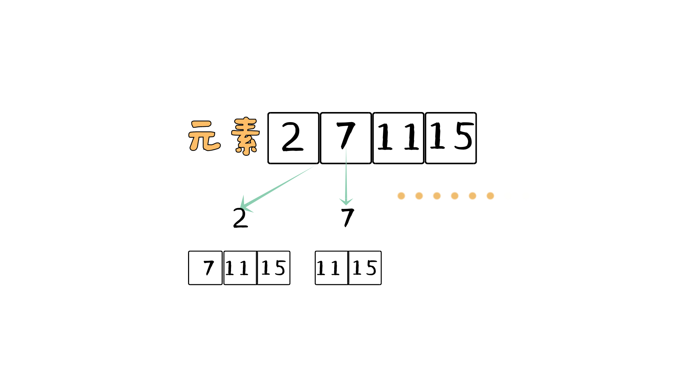
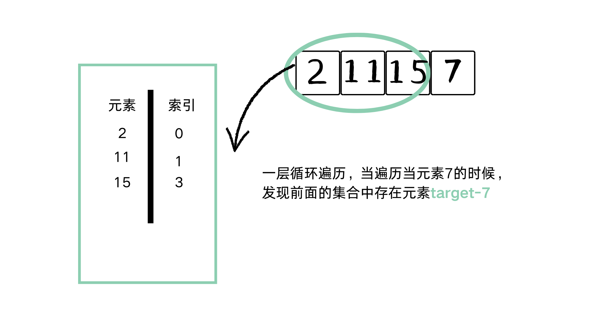

## 数组基础：

<font color=Aquamarine>数据结构是算法的载体</font>，先来看一个最基础最基础的数据结构：<font color=Aquamarine>数组</font>。

数组用于存储相同类型的元素的集合。这些元素可以通过索引访问，索引通常是从零开始的整数，数组是一段连续的内存空间。数组示意图如下：



数组支持通过索引直接访问元素，这使得数组在随机访问时速度很快。时间复杂度为 O(1)。但在插入和删除操作中，可能需要移动大量元素，导致时间复杂度为 O(n)。

## 创建数组

C++中提供两种方式创建数组。

### 原始数组

```cpp
int myArray[6] = {1, 2, 3, 4, 5, 6};
```
### vector容器
```cpp
#include <vector>
std::vector<int> myVector = {1, 2, 3, 4, 5, 6};
```
vector提供了许多常见的功能，包括push_back、pop_back以及一些迭代器操作，相关的基础知识可通过C++的学习了解。

## 数组第一题：两数之和

[力扣原题](https://leetcode.cn/problems/two-sum/description/?envType=study-plan-v2&envId=top-100-likedn)

题目描述：给定一个整数数组 nums 和一个整数目标值 target，请你在该数组中找出和为目标值target的那两个整数，并返回它们的数组下标。

注意：可以假设每种输入只会对应一个答案。但是，数组中同一个元素在答案里不能重复出现。

示例：

输入：nums = [2,7,11,15], target = 9

输出：[0,1]，因为 nums[0] + nums[1] == 9 ，返回 [0, 1] 。

### 暴力解法

各位新手朋友不要一上来就想着技巧、算法，暴力是第一步，算法是暴力的改进，举个例子：暴力解法使用了100个人，而你通过改进实现1个人解决。

这道题的本质是寻找数组中的两个数，判断两数之和是否等于目标数，如果相等，输出这两个数的下标。

我们先指定一个数2，然后再遍历7、11、15，看看2和[7、11、15]中有没有匹配，如果没有，再指定数字7，遍历[11、15]……通过下图可以很好理解



两层for循环就可以实现，时间复杂度是O(n^2)。具体实现代码如下：

```cpp
class Solution {
public:
    vector<int> twoSum(vector<int>& nums, int target) {
        for(int i=0;i<nums.size();i++){
            for(int j=i+1;j<nums.size();j++){
                if(nums[i]+nums[j]==target){
                    return {i,j};
                }
            }
        }
       return {}; 
    }
};
```

多层循环是比较费时的，有没有办法可以优化成一层循环？

有这样的想法，把遍历过的元素放进一个集合，假设集合中已经有了n个元素，当遍历第n+1个元素时，判断集合中是否存在target-nums[n+1]的元素，这样一层循环就可以实现。



但是这个集合中要包含元素以及元素的下标，因为返回值就是下标，引出一个重要的数据结构：Hash表。其实数组就是一个Hash表，但是很难通过数组元素的值找到对应的下标，不能作为本题的数据结构载体。

C++中定义了由哈希表实现的结构unordered_map,unordered_map是一种key-value的存储结构，key保存数值，value保存数值对应的下标，key无序且不可重复。

unordered_map的重要函数如下：

find函数用于查找给定键对应的迭代器。

其返回值是一个迭代器，如果找到了指定键，则返回指向该键值对的迭代器；如果未找到，则返回指向容器末尾的迭代器，即map.end()。

给出具体的实现代码：

```cpp
class Solution {
public:
    vector<int> twoSum(vector<int>& nums, int target) {
        std::unordered_map <int,int> temp;
        for(int i=0;i<nums.size();i++){
            auto it = temp.find(target-nums[i]);
            if(it != temp.end()){
                return {it->second,i};
            }
            temp[nums[i]] = i;
        }
       return {}; 
    }
};
```


