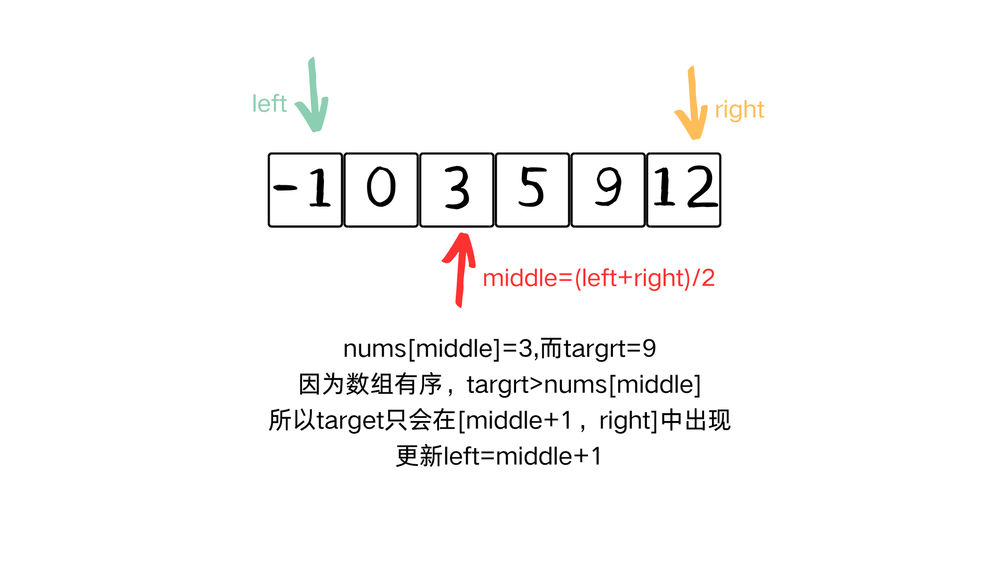
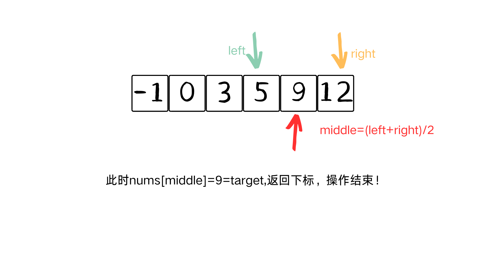

>学习地址:https://github.com/tiannT/Algorithm-Note

## 1、题目

- 给定一个 n 个元素有序的（升序）整型数组 nums 和一个目标值 target  ，写一个函数搜索 nums 中的 target，如果目标值存在返回下标，否则返-1。
- 示例：nums1 = [-1,0,3,5,9,12], target = 9
输出：4, 因为9 出现在 nums 中并且下标为 4
- 数据：你可以假设 nums 中的所有元素是不重复的。
n 将在 [1, 10000]之间。
nums 的每个元素都将在 [-9999, 9999]之间。

## 2、思路

### 2.1 暴力

暴力的解法非常简单，一个for循环直接遍历，时间复杂度是O(n)。但假如面试时候问你，你可以再优化一下时间复杂度吗？那就用到了本节主题：二分查找。
```cpp
class Solution {
public:
    int search(vector<int>& nums, int target) {
        int i = 0;
        for (; i < nums.size(); i++) {
            if (nums[i] == target) {
                return i;
            } 
        }
        return -1;
    }
};
```

### 2.2 二分查找

**二分法是由前提的：有序数组、无重复元素**。用图来理解二分法，体会分而治之的算法设计策略。



所以二分法查询数据的关键是：

1、确定middle,也就是中间索引

2、如果nums[middle]<target,更新left=middle+1;

如果nums[middle]>target,更新right=middle-1

给出代码实现：

```cpp
class Solution {
public:
    int search(vector<int>& nums, int target) {
        int left = 0;
        int right = nums.size() - 1;
        while (left <= right) {
            int mid = left + (right - left) / 2;//避免溢出
            if (nums[mid] == target) {
                return mid;
            } else if (nums[mid] < target) {
                left = mid + 1;
            } else {
                right = mid - 1;
            }
        }
        
        return -1;
    }
};
```
**那二分查找的时间复杂度是多少呢？**

二分查找是一种分治算法，其时间复杂度为 O(log n)，其中 n 是数组的元素数量。

具体来说，如果数组长度为 n，那么第一次迭代搜索的区间是整个数组，第二次迭代搜索的区间是原来的一半，以此类推。因此，最坏情况下，二分查找需要进行 log₂n 次迭代，直到搜索范围被缩小为1，即找到目标元素或搜索范围为空。

假设总共有n个元素，每次查找的区间大小就是n、n/2、n/4…[n/（2^k）]由于[n/（2^k）]取整后>=1，所以[n/（2^k）]=1，k=log₂n 。
