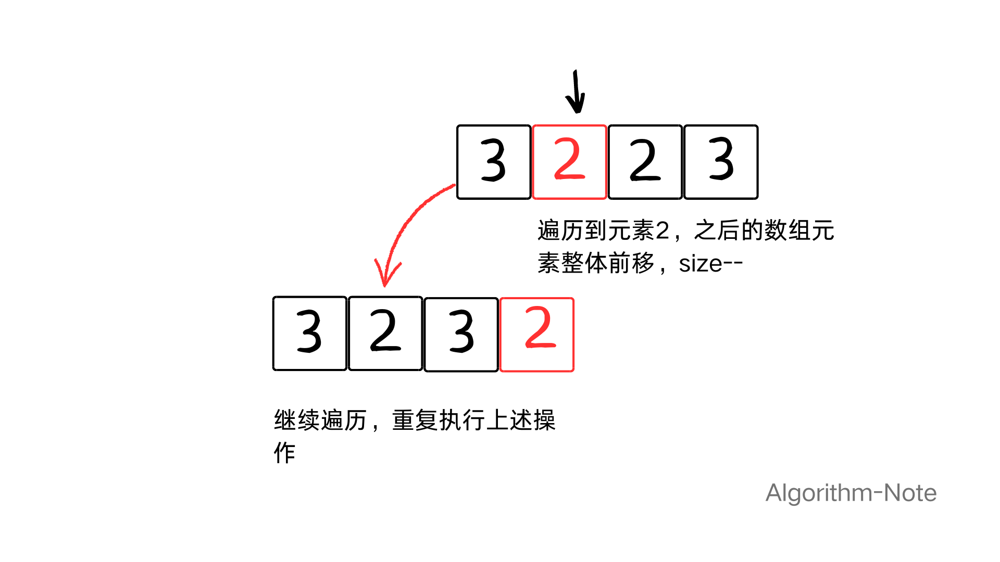

>学习地址:https://github.com/tiannT/Algorithm-Note
## 1、题目

[力扣原题]([https://leetcode.cn/problems/remove-element/description/]

- 给你一个数组 nums 和一个值 val，你需要原地移除所有数值等于 val 的元素，并返回移除后数组的新长度。不要使用额外的数组空间，你必须仅使用 O(1) 额外空间并原地修改输入数组。元素的顺序可以改变。你不需要考虑数组中超出新长度后面的元素。
- 示例：：nums = [3,2,2,3], val = 3 ；输出：2, nums = [2,2]
- 数据：0 <= nums.length <= 100；0 <= nums[i] <= 50；0 <= val <= 100

## 2、思路

### 2.1 暴力

这道题得难点在于**使用 O(1) 额外空间并原地修改输入数组**，试想如果没有这个要求，一个for循环，再引入一个新的数组，就解决了，但现在得要求是在原来得基础上修改，而且因为数组的特性是连续空间，所以删除元素只能通过覆盖来实现。那暴力的思路如下：



一个for循环遍历数组元素，判断是否等于val,如果是的话，再移动整个数组，这又需要一个for循环，时间复杂度O(n^2)。代码如下：

```cpp
class Solution {
public:
    int removeElement(vector<int>& nums, int val) {
        int size = nums.size();
        for (int i = 0; i < size; i++) {
            if (nums[i] == val) { 
                for (int j = i+1; j <size; j++) {
                     nums[j - 1]=nums[j];
                }
                i--; 
                size--; 
            }
        }
        return size;
    }
};
```

### 2.2 双指针法

双指针也叫快慢指针，对于优化数组for循环是常用的算法。在暴力解法中，我们用一个for循环寻找目标元素，另一个for循环移动数组元素位置。那可以用指针pointer2寻找新数组元素，指针pointer1更新元素位置。如下图：


给出代码实现：

```cpp
class Solution {
public:
    int removeElement(vector<int>& nums, int val) {
        int n = nums.size();
        int pointer1 = 0;
        for (int pointer2 = 0;  pointer2 < n;  pointer2++) {
            if (nums[pointer2] != val) {
                nums[pointer1] = nums[pointer2];
                pointer1++;
            }
        }
        return pointer1;
    }
};
```
